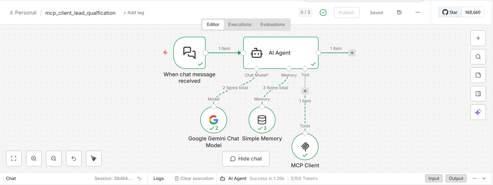
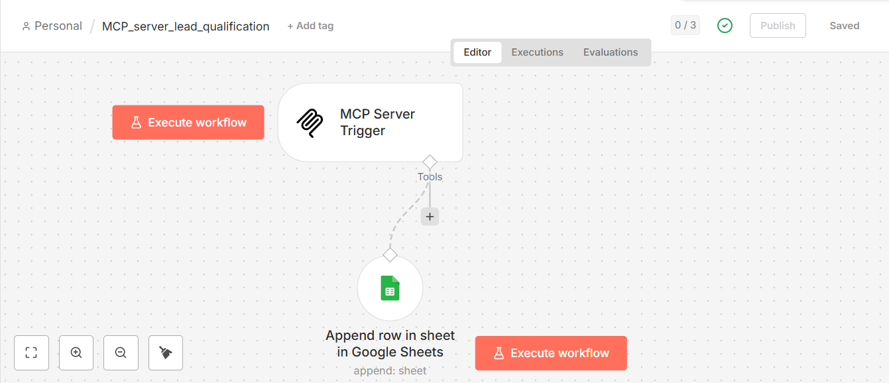
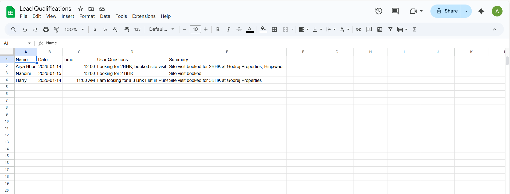

# AI Lead Qualification & Site Visit Scheduler (MCP + n8n)

An AI-powered lead qualification and site visit scheduling system built using **MCP (Model Context Protocol)**, **n8n**, **Google Gemini**, and **Google Sheets**.  
The system acts as a virtual real estate agent that qualifies prospects, answers property-related questions, and books site visits automatically.

---

## 🚀 Features

- AI-based lead qualification using Google Gemini
- MCP server–client architecture for structured AI tool calling
- Automated site visit scheduling with time validation
- Google Sheets integration as a lightweight CRM
- Off-topic conversation handling and redirection
- Configurable working hours and timezone support
- Production-ready workflow built in n8n

---

## 🏢 Use Case

The AI agent acts as **Sarah**, a friendly real estate lead qualification agent for **Godrej Properties, Hinjawadi (Pune)**.  
She:
- Answers property-related questions
- Qualifies interested leads
- Schedules site visit appointments
- Stores lead data in Google Sheets

---

## 🖼️ Workflow & Data Screenshots

### 1️⃣ MCP Client Workflow (n8n)
This workflow handles user interaction, AI agent execution using Google Gemini, and communicates with the MCP server for lead qualification and site visit scheduling.

---

### 2️⃣ MCP Server Workflow
The MCP server exposes tools to process booking requests and stores validated lead and visit data into Google Sheets.

---

### 3️⃣ Lead Data Stored in Google Sheets
All qualified leads and confirmed site visit details are automatically stored in Google Sheets, acting as a lightweight CRM.

---

## 🧠 System Architecture

User (Chat) 
↓ 
n8n Chat Trigger 
↓ 
AI Agent (Google Gemini) 
↓ 
MCP Client 
↓ 
MCP Server 
↓ 
Google Sheets (Lead Storage)

---

## 🛠 Tech Stack

- **n8n** – Workflow automation
- **MCP (Model Context Protocol)** – AI tool orchestration
- **Google Gemini** – Conversational AI model
- **Google Sheets** – Lead database
- **JavaScript / JSON** – Workflow configuration

---

## 📅 Booking Rules

- Weekdays: 10 AM – 6 PM
- Weekends: 10 AM – 4 PM
- Timezone: Asia/Kolkata (+05:30)
- Prevents booking past dates or outside working hours

---

## 📊 Stored Lead Data (Google Sheets)

- Name
- Mobile Number
- Preferred Configuration
- Visit Date & Time
- Lead Status
- Timestamp

---

## ⚙️ How to Run the Project

### 1️⃣ Prerequisites
- n8n (self-hosted or cloud)
- Google Gemini API access
- Google Sheets account
- MCP server set up and running

---

### 2️⃣ Import n8n Workflow
1. Open **n8n**
2. Click **Workflows → Import**
3. Upload the provided workflow JSON file
4. Update credentials:
   - Google Gemini
   - Google Sheets
   - MCP Server endpoint

---

### 3️⃣ Configure MCP Server
- Ensure MCP server exposes tools for:
  - Saving lead data
  - Scheduling site visits
- Update MCP client node with correct server URL

---

### 4️⃣ Test the Flow
- Trigger chat input
- Ask property-related questions
- Confirm site visit
- Verify lead entry in Google Sheets

---

## 📌 Future Enhancements

- WhatsApp / Telegram integration
- Lead scoring
- CRM integration (HubSpot / Zoho)
- Follow-up automation
- Rescheduling and cancellation handling

---

## 👤 Author

**Arya Bhor**  
GitHub: https://github.com/arya10012
